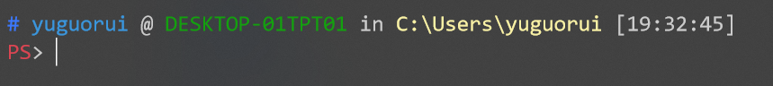
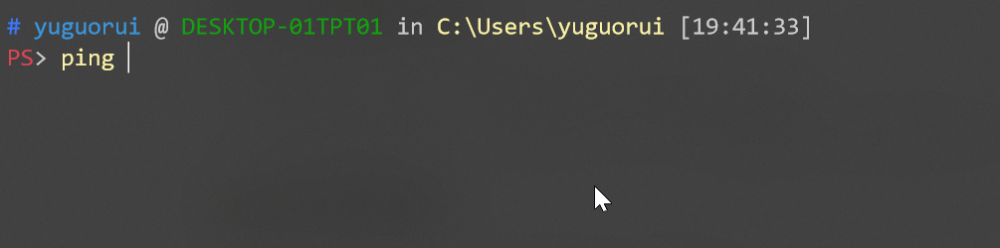
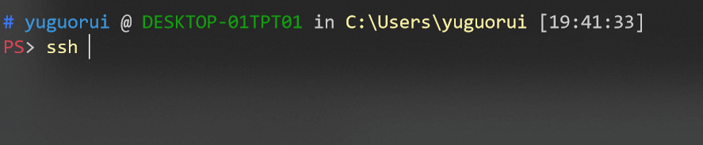
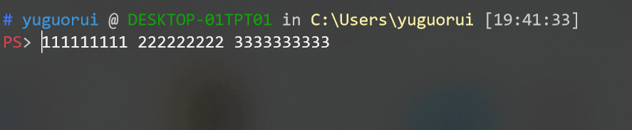

# oh-my-tiny-posh

A lightweight and useful config of PowerShell



## Features

- An elegant theme "ys" for PowerShell, from oh-my-zsh we all love.
- UpArrow(↑) for history completion with prefix. 
- Hostname completion for SSH.
- Some handy keyboard mappings, such as Ctrl+A, Ctrl+W, etc.
- Current session indications (hostname, current user, exit code of last command)
- Lightweight, because of only a few lines of code.

## Demo

### UpArrow history completion



### Hostname completion



### Handy keyboard mappings

- Ctrl+A, move the cursor to the beginning of the line.
- Ctrl+E, move the cursor to the end of the line.
- Ctrl+W, delete last word.
- Alt+F/W, move the cursor to the next/previous word.



## Prerequisites

- Windows 10 1703 or above for the colorful theme.
- `~/.ssh/config`, if you want to use the hostname completion for SSH.

## Installation

To enable the config edit your PowerShell profile:

```powershell
if (!(Test-Path -Path $PROFILE )) { New-Item -Type File -Path $PROFILE -Force }
notepad $PROFILE
```

Append the contents of the `profile.ps` to your PowerShell profile.

That is it.

### Based on work by

[oh-my-zsh](https://github.com/ohmyzsh/ohmyzsh)

